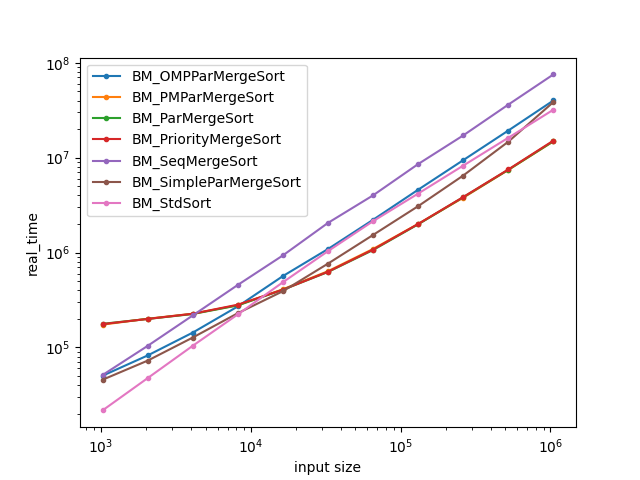

# Multithreaded-Sort⚡

A multithreaded merge sort implementation with performance benchmarking using [Google Benchmark](https://github.com/google/benchmark).  
Visualize the speedup and efficiency of multithreaded sorting with auto-generated graphs.

---

## Features

- ✅ Multithreaded merge sort using a custom thread pool
- ✅ Custom `ThreadPool` implementation using condition variables and `std::function`
- ✅ Google Benchmark integration for rigorous performance testing
- ✅ CSV export of benchmark results
- ✅ Python script to visualize performance graphs

---

## Installation

### 1. Clone this repository
```bash
git clone https://github.com/Demigod345/Multithreaded-Sort.git
cd Multithreaded-Sort
```

### 2. Install Google Benchmark

Follow official instructions here:  
 [Google Benchmark Installation Guide](https://github.com/google/benchmark#installation)

Make sure to build with `-DBENCHMARK_ENABLE_GTEST_TESTS=OFF` to skip tests.

---

## Build & Run

### Compile the program:
```bash
g++ merge_sort.cpp -std=c++11 -isystem benchmark/include \
  -Lbenchmark/build/src -lbenchmark -lpthread -o merge_sort
```

### Run the benchmark and export results:
```bash
./merge_sort --benchmark_format=csv > benchmark.csv
```

---

## Plot the Benchmark

Use the provided Python script to generate graphs:

```bash
python3 plot.py -f benchmark.csv
```

### Output Visualization

#### Linear Scale


#### Logarithmic Scale


---

## Files

| File         | Description                            |
|--------------|----------------------------------------|
| `merge_sort.cpp` | Core multithreaded merge sort logic   |
| `thread_pool.h`   | ThreadPool with task queue + CV logic |
| `plot.py`        | Graphs runtime from CSV benchmark     |
| `benchmark.csv`  | Output benchmark (auto-generated)     |

---

## Future Work

- [ ] Add quicksort-based variant
- [ ] Adaptive load balancing across threads
- [ ] Lock-free queue support for ThreadPool

---

## License

MIT License ©️ 2025 Demigod345
