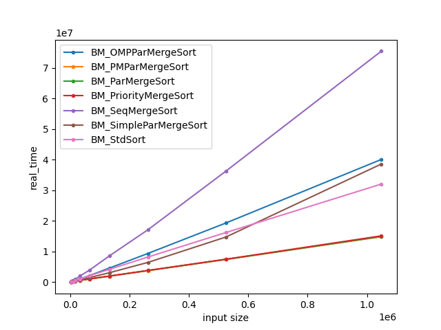

# Multithreaded-Sort⚡

A multithreaded merge sort implementation with performance benchmarking using [Google Benchmark](https://github.com/google/benchmark).  
Visualize the speedup and efficiency of multithreaded sorting with auto-generated graphs.

---

## Features

- **Multiple Merge Sort Variants**
  - Standard library sort (for reference)
  - Classic sequential merge sort
  - Naive parallel merge sort (spawns a thread at each recursive call)
  - OpenMP optimised merge sort
  - Parallel merge sort using custom thread pools with load balancing
- **Thread Pool Implementation**
  - Efficient task management with minimal thread creation overhead
  - Safe queueing and graceful shutdown
- **Benchmarking**
  - Uses Google Benchmark to compare performance across implementations and input sizes
  - Exporting of benchmark results to CSV / JSON formats
- **Visualization**
  - Python plotting script to analyze and compare timing results, both in normal and logarithmic scale

---

## Installation

### 1. Clone this repository
```bash
git clone https://github.com/Demigod345/Multithreaded-Sort.git
cd Multithreaded-Sort
```

---

## Build & Run

### Compile the program using the makefile (Ensure Homebrew is installed, and can download Google Benchmark and OpenMP):
```bash
make
```

### Run the benchmark and export results:
```bash
./merge_sort --benchmark_format=json > benchmark.json
```

---

## Plot the Benchmark

Use the provided Python script to generate graphs:

```bash
python3 plot.py -f benchmark.json
```

### Output Visualization

#### Linear Scale


#### Logarithmic Scale


---

## Files

| File             | Description                                        |
|------------------|----------------------------------------------------|
| `merge_sort.cpp` | Core multithreaded merge sort logic                |
| `thread_pool.h`  | ThreadPool with task queue + synchronisation logic |
| `plot.py`        | Graphs runtime from benchmark results file         |
| `benchmark.csv`  | Output benchmark (auto-generated)                  |

---

## Group Members

| Name               | Enrollment Number        |
|--------------------|--------------------------|
| Divyansh Jain      | 22114032                 |
| Ishan Garg         | 22125012                 |
| Sukrit Jindal      | 22125037                 |
| Vyusti Singamsetti | 21112108                 |

---

## License

MIT License ©️ 2025 Demigod345
